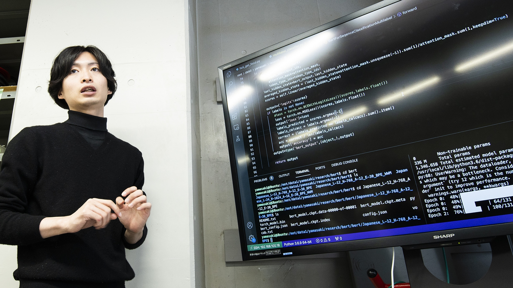

# 情報工学科 💻

## 学科紹介

情報工学科では、**プログラミング** や *ネットワーク技術* を学ぶことができます。

### 学べる内容

- プログラミング
- Web開発
- データベース
- AI
- ネットワーク

### 授業の流れ

1. 基礎を学ぶ
2. 実習を行う
3. チーム開発を経験する
4. 卒業研究を行う

## 情報工学科の特徴

| 分野 | 内容 |
|---|---|
| プログラミング | PythonやJavaを学ぶ |
| AI | 人工知能を学ぶ |
| ネットワーク | サーバや通信を学ぶ |

## キャンパス写真

## 関連リンク

- [拓殖大学公式サイト](https://www.takushoku-u.ac.jp/)
- [GitHub](https://github.com/)

## 感想 😊

情報工学大好き！